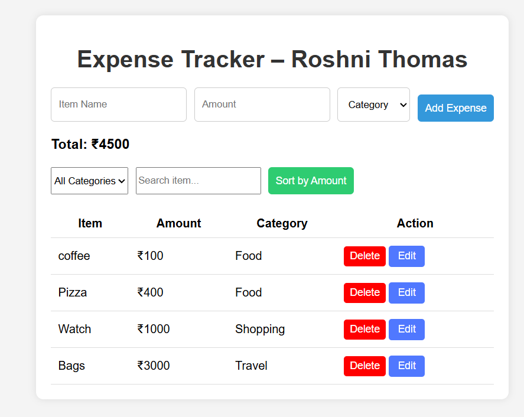

# Expense Tracker Web App

A simple and clean web-based expense manager built using HTML, CSS, and JavaScript.

## Features
- Add, edit, delete expenses
- Search expenses by name
- Filter by category
- Sort by amount
- Data saved permanently using LocalStorage
- Clean and responsive UI

## Live Demo
https://roshniannthomas.github.io/expense-tracker/

## Tech Stack
- HTML
- CSS
- JavaScript (LocalStorage)

